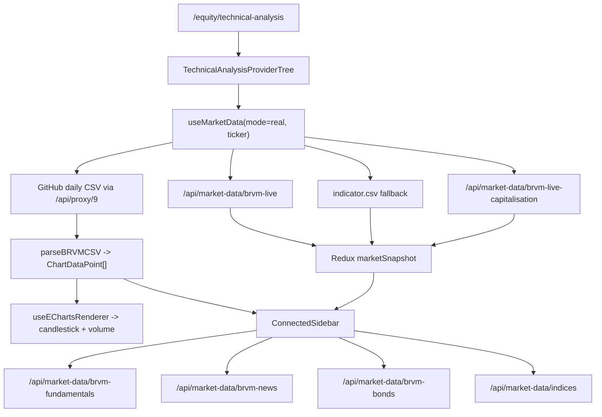

# Architecture des Donnees de Marche - Technical Analysis

Revision verifiee le 2026-06-04.

Ce document decrit le flux reel utilise par la page
`/equity/technical-analysis`, notamment la zone du graphique principal et la
sidebar droite. Il est ecrit pour qu'un autre LLM, un backend engineer ou un
fournisseur de donnees puisse comprendre exactement ce qui existe, ce qui est
simule, et ce qui manque.

## 1. Synthese Operationnelle

La route `app/equity/technical-analysis/page.tsx` monte le composant client
`components/technical-analysis/TechnicalAnalysis.tsx`.

Le graphique principal utilise aujourd'hui principalement des donnees
historiques journalieres OHLCV chargees depuis un CSV public GitHub via le
proxy Next.js. La sidebar droite combine ces memes donnees chart, un snapshot
live quand il est disponible, des metadonnees statiques locales, et plusieurs
routes Next.js qui scrappent `brvm.org`.

Decision produit 2026-06-04 : le module intraday BRVM est retire du produit. Il ne doit plus exister de hook de seance, de helper reseau dedie, de route API dediee, de lecture Redis/Upstash de snapshots de seance, ni de mapping applicatif `1m` vers `5m`. Le terminal visible reste un chart daily OHLCV enrichi par snapshot live.

Cette decision est volontaire. Une demande future devra ouvrir une nouvelle fonctionnalite avec source-of-truth, contrat API, tests et validation de donnees; les fichiers retires ne doivent pas etre ressuscites par defaut.

## 2. Reponse Courte Aux 6 Questions Data

### 2.1 Source des donnees

Sources utilisees :

1. Historique daily OHLCV :
   `Fredysessie/brvm-data-public` via
   `/api/proxy/9/Fredysessie/brvm-data-public/main/data/{TICKER}/{TICKER}.daily.csv`.

2. Snapshot indicator CSV :
   `Fredysessie/brvm-data-public` via
   `/api/proxy/9/Fredysessie/brvm-data-public/main/data/{TICKER}/{TICKER}.indicator.csv`.

3. Scraping BRVM officiel :
   routes Next.js sous `/api/market-data/*`, principalement `brvm-live`,
   `brvm-live-capitalisation`, `brvm-fundamentals`, `brvm-news`, `brvm-bonds`
   et `indices`.

4. Metadonnees statiques internes :
   `core/data/brvm-securities.ts` pour le nom, secteur, pays, logo, P/E,
   rendement YTD, revenu T12M, market cap fallback, ISIN et FIGI.

Pas de fichier Excel ou PDF directement branche sur cet ecran. Pas de base
interne pour les bougies daily visibles. Pas de source Redis/Upstash intraday
BRVM dans le flux applicatif.

### 2.2 Frequence de mise a jour

| Donnee | Frequence actuelle | Cache / polling |
| --- | --- | --- |
| CSV daily action | En pratique une ligne par jour | Fetch initial + polling frontend 5 min |
| CSV indicator | Selon mise a jour GitHub externe | Fallback si scraper live echoue |
| Scraper `brvm-live` | A la requete | Cache serveur 15 min, stale 24h |
| Scraper capitalisation | A la requete | Cache serveur 30 min, stale 24h |
| News BRVM | A la requete | Frontend 30 min, serveur 1h |
| Fondamentaux | Au changement de ticker | Cache HTTP 24h |

### 2.3 Type de donnees disponibles

Donnees disponibles pour le chart principal :

- `time`
- `open`
- `high`
- `low`
- `close`
- `volume`

Donnees disponibles pour la sidebar :

- prix live ou dernier close
- variation et variation pourcentage
- volume courant
- volume moyen 30 periodes
- capitalisation globale et nombre de titres, si scraper capitalisation OK
- fondamentaux scrappes : earnings, revenues, dividends, profile, website,
  employees
- metadonnees statiques : secteur, pays, P/E, return YTD, revenue T12M,
  market cap fallback

Donnees non disponibles aujourd'hui sur l'ecran visible :

- transactions intraday reelles
- carnet d'ordres
- bid/ask depth
- tick-by-tick
- flux websocket
- vraies bougies 1m/5m/15m branchees au renderer principal

### 2.4 Backend

Le backend utilise par cet ecran est Next.js App Router. Les routes Django
mentionnees dans certains commentaires du proxy ne sont pas le flux effectif
du chart BRVM visible.

Routes Next.js impliquees :

- `app/api/proxy/[...path]/route.ts`
- `app/api/market-data/brvm-live/route.ts`
- `app/api/market-data/brvm-live-capitalisation/route.ts`
- `app/api/market-data/brvm-fundamentals/route.ts`
- `app/api/market-data/brvm-news/route.ts`
- `app/api/market-data/brvm-bonds/route.ts`
- `app/api/market-data/indices/route.ts`


### 2.5 Frontend

Le frontend lit directement les routes API Next.js. Il ne lit pas directement
une API Django pour le chart BRVM actuel.

Les bougies daily sont deja donnees par le CSV source puis parsees cote
frontend par `parseBRVMCSV()`. ECharts recoit ensuite :

- `dates`: axe X
- `values`: `[open, close, low, high]`
- `volumes`: `[index, volume, direction]`

Les indicateurs techniques sont calcules cote frontend dans un worker via
`useEChartsRenderer`.

### 2.6 Exemple de payload actuel

Dernieres lignes reelles du CSV daily BOAB observees via localhost :

```csv
Date,Open,High,Low,Close,Volume
2026-05-12,9405,9445,9405,9420,11117
2026-05-13,9420,9420,9405,9410,2844
2026-05-15,9415,9420,9320,9400,2830
2026-05-18,9400,9400,9320,9400,4370
2026-05-19,9400,9400,9365,9400,4953
```

Equivalent `ChartDataPoint` apres parsing :

```json
{
  "time": "2026-05-19",
  "open": 9400,
  "high": 9400,
  "low": 9365,
  "close": 9400,
  "volume": 4953
}
```

Snapshot indicator BOAB observe :

```csv
Ticker,URL_Ticker,Cours_Actuel,Variation_Cours,Volume_Titres,Volume__,Ouverture,Plus_Haut,Plus_Bas,Cloture_Veille,Beta_1_An,RSI,Capital_Echange,Valorisation
BOAB,BOAB.bj,9400.0,"0,00%",1906.0,17916400.0,9420.0,9420.0,9400.0,9400.0,0.17,83.2,0.0,381 274 M
```

Capitalisation BOAB observee :

```json
{
  "symbol": "BOAB",
  "name": "BANK OF AFRICA BENIN",
  "sharesCount": 40561048,
  "lastPrice": 9415,
  "floatingMarketCap": 86215.108,
  "globalMarketCap": 381882.26692,
  "source": "BRVM_CAPITALIZATION",
  "cacheStatus": "HIT"
}
```

Etat live observe :

```json
{
  "error": "Ticker BOAB not found"
}
```

## 3. Cartographie Des Fichiers

| Fichier | Role |
| --- | --- |
| `app/equity/technical-analysis/page.tsx` | Route client qui rend `TechnicalAnalysis` |
| `components/technical-analysis/TechnicalAnalysis.tsx` | Orchestration UI chart, sidebar, toolbar, layout |
| `components/technical-analysis/context/TechnicalAnalysisProviders.tsx` | Initialise ticker, devise, refs chart, market data |
| `components/technical-analysis/hooks/MarketData/useMarketData.ts` | Charge daily CSV, enrichit snapshot live, expose chartData |
| `components/technical-analysis/hooks/useEChartsRenderer.ts` | Transforme chartData en series ECharts et calcule indicateurs |
| `components/technical-analysis/components/sidebar/TechnicalAnalysisSidebar.tsx` | Affiche watchlist, stats, news, fondamentaux, bonds, indices |
| `core/data/brvm-securities.ts` | Source statique locale pour les titres BRVM |
| `shared/utils/resilient-scraper.ts` | Scraping resilient avec cache L1, Redis, SWR et circuit breaker |

## 4. Flux Du Graphique Principal

### 4.1 Initialisation

`TechnicalAnalysisProviderTree` initialise :

- ticker initial : `BOAB`
- devise initiale : `XOF`
- mode data Redux par defaut : `real`

`MarketDataProvider` appelle :

```ts
useMarketData(dataMode, selectedTicker?.ticker)
```

### 4.2 Chargement daily

Pour un ticker `BOAB`, le hook construit :

```txt
/api/proxy/9/Fredysessie/brvm-data-public/main/data/BOAB/BOAB.daily.csv
```

Le CSV est parse par `parseBRVMCSV()` :

- detection du separateur `;` ou `,`
- detection colonnes date/open/high/low/close/volume
- support des formats francais `DD/MM/YYYY`
- conversion des virgules decimales
- filtrage des points invalides
- tri chronologique

Le resultat est stocke dans `chartData` et, au chargement initial, dans Redux
via `updateMarketData({ symbol, data })`.

### 4.3 Enrichissement snapshot

Apres le daily, le hook lance en arriere-plan :

```txt
/api/market-data/brvm-live?ticker=BOAB
/api/market-data/brvm-live-capitalisation?ticker=BOAB
```

Si `brvm-live` echoue ou ne trouve pas le ticker, le hook tente :

```txt
/api/proxy/9/Fredysessie/brvm-data-public/main/data/BOAB/BOAB.indicator.csv
```

Le snapshot final est stocke dans Redux via :

```ts
updateMarketSnapshot({ symbol, snapshot })
```

### 4.4 Rendering ECharts

`useEChartsRenderer` recoit `chartState.displayChartData`, puis extrait :

```ts
dates.push(item.time)
values.push([item.open, item.close, item.low, item.high])
volumes.push([i, item.volume, item.close > item.open ? 1 : -1])
```

La serie principale est :

- `candlestick` si `chartConfig.chartType === "candlestick"`
- `line` sinon

Le panneau volume est une serie `bar` separee.

## 5. Flux De La Sidebar Droite

La sidebar recoit ses props depuis `ConnectedSidebar` dans
`TechnicalAnalysis.tsx`.

Elle combine :

1. `security`
   Donnees statiques de `BRVM_SECURITIES`.

2. `chartData`
   Historique daily du hook `useMarketData`.

3. `liveSnapshot`
   Snapshot Redux du prix, variation, volume, open/high/low/prevClose et
   capitalisation enrichie.

4. `fundamentals`
   Donnees scrappees par `/api/market-data/brvm-fundamentals`.

5. `news`
   Donnees scrappees par `/api/market-data/brvm-news`.

6. `indices`
   Donnees scrappees par `/api/market-data/indices`, seulement quand le
   panneau indices est ouvert.

7. `bonds`
   Donnees scrappees par `/api/market-data/brvm-bonds`.

La section watchlist de la capture utilise principalement :

- `security.name`
- `security.logoUrl`
- `livePrice`
- `liveChange`
- `liveChangePercent`
- `lastUpdate`
- `liveVolume`
- `security.sector`
- `security.country`

La section statistiques cles utilise :

- `displayReturnYTD = liveReturnYTD ?? security.returnYTD`
- `displayPeRatio = livePeRatio ?? security.peRatio`
- `currentVolume`
- `avgVolume`
- `financialMetrics.calculatedYield` ou `security.revenueT12M`
- `displayMarketCap = liveMarketCap ?? security.marketCap`

## 6. Backend Next.js Et Scraping

### 6.1 Proxy GitHub / API externe

`/api/proxy/[...path]` lit l'identifiant d'API dans le premier segment de
chemin. Pour les donnees BRVM GitHub, l'identifiant utilise est `9`, donc
`API_TARGET_9` doit pointer vers la base externe attendue.

Le proxy ajoute :

- sanitization de chemin
- rate limit optionnel
- cache optionnel
- circuit breaker
- retry pour GET/HEAD
- headers securises

### 6.2 Scraper resilient

`fetchWithResilience()` fournit :

- cache L1 memoire 60 secondes
- cache Redis si disponible
- stale-while-revalidate
- circuit breaker pour `brvm.org`
- timeouts undici
- fallback stale quand la source BRVM ralentit

Ce mecanisme protege les routes :

- `brvm-live`
- `brvm-live-capitalisation`
- `brvm-fundamentals`
- `brvm-news`
- `brvm-bonds`
- `indices`

## 7. Intraday BRVM Retire

Le projet ne doit plus contenir de surface applicative intraday BRVM.

Effets attendus :

- aucun hook de seance dans les providers ou le chart principal ;
- aucune route API dediee aux bougies de seance cote App Router ;
- aucun fallback Redis/Upstash de snapshots de seance ;
- aucune roadmap locale ne doit demander de brancher des timeframes de seance BRVM.

Les donnees non disponibles restent non disponibles. Le produit ne simule pas de bougies de seance pour combler cette absence.

## 8. Schema De Decision Recommande



## 9. Recommandations D Integration

### Priorite 1 : garder MarketData honnete

Le contrat public reste daily OHLCV plus snapshot live. Aucune UI, hook ou doc ne doit laisser croire que le produit possede un flux intraday BRVM.

### Priorite 2 : normaliser les tickers BRVM

`brvm-live?ticker=BOAB` retourne actuellement une erreur, alors que le daily CSV et la capitalisation BOAB fonctionnent. Il faut aligner les symboles entre :

- tickers internes (`BOAB`)
- tickers BRVM officiels avec suffixe eventuel (`BOABC`, etc.)
- chemins GitHub (`BOAB/BOAB.daily.csv`)
- mapping `BRVM_NAME_TO_TICKER`

### Priorite 3 : marquer clairement la provenance des chiffres sidebar

Les champs `returnYTD`, `peRatio`, `revenueT12M` et certains fondamentaux peuvent venir de donnees statiques ou d estimations. Chaque valeur exposee a un autre LLM devrait avoir une provenance.

## 10. Verite Finale

Algoway possede deja une bonne base daily OHLCV, une architecture de scraping resiliente et un enrichissement live partiel. Il ne possede pas de flux intraday BRVM dans l application active. Toute affirmation contraire dans du code, une doc ou une roadmap doit etre traitee comme un zombie architectural a supprimer.
